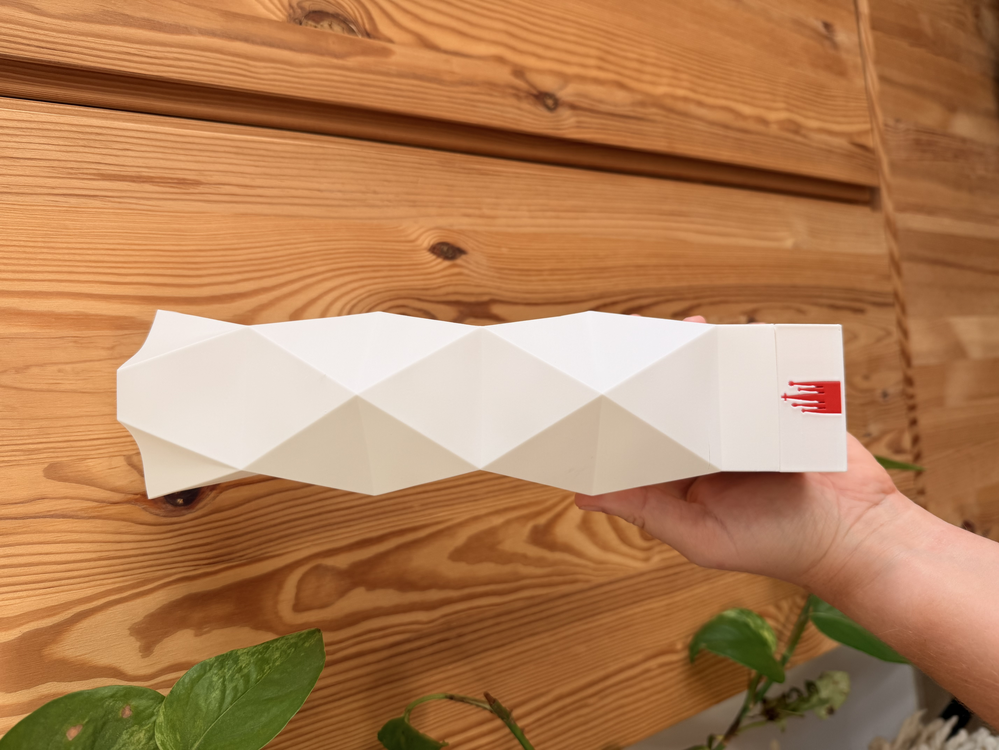

# Sagrada Familia Lamp

3D printable models (WIP) of the lamps from the Sagrada Familia central tower inauguration event.

Context and hacking journey [on this thread](https://x.com/merybenavente/status/2065018276019589430).

The OpenSCAD files are in `3d_models/` — feel free to print, tweak, and open PRs!

Ready-to-print model on [MakerWorld](https://makerworld.com/en/models/2920312-tower-of-jesus-lamp-sagrada-familia-inauguration#profileId-3267552), thanks to [David Marco](https://github.com/nozamdavid) for his central contributions to the 3D models.

